# Dynamic Zero — DIY Build Guide

This guide contains the parts, materials and basic instructions required to reproduce the Dynamic Zero reference build.

The parts shown below are the parts used for this build.

> **Sourcing note:** The links below point to parts used for the reference build.
> AliExpress listings may change or disappear over time. The photographs and
> specifications in this guide remain the reference.

---

## 1. Parts and Materials

### 1.1 Speakers

Use **SOTAMIA 2" full-range, 4 Ω, 10 W drivers**.

For the basic build, **two drivers connected in series are recommended**.

Different drivers will behave differently.

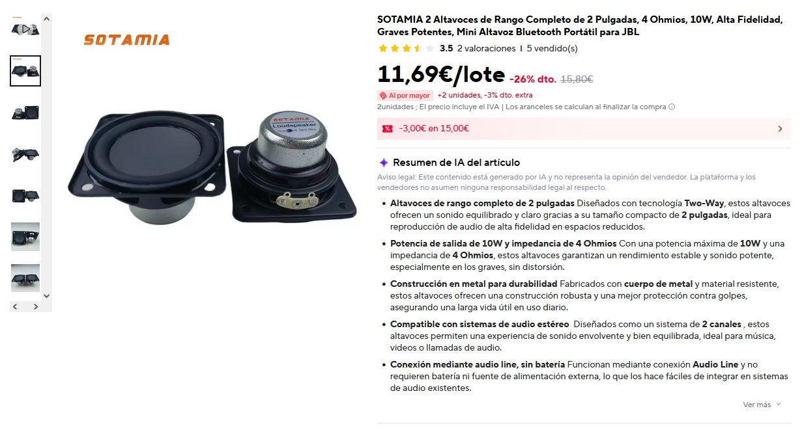

**Source:** [AliExpress](https://es.aliexpress.com/item/1005011892426743.html)

### Driver dimensions

Reference dimensions for the specified driver and gaskets:

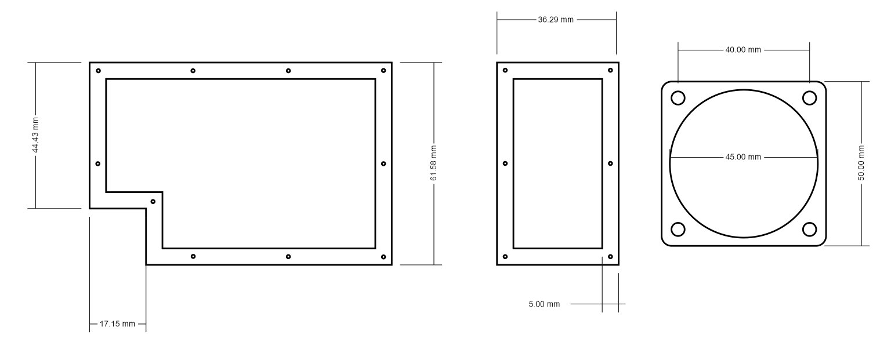

---

### 1.2 Speaker Connectors

Use **4 mm banana connectors**.

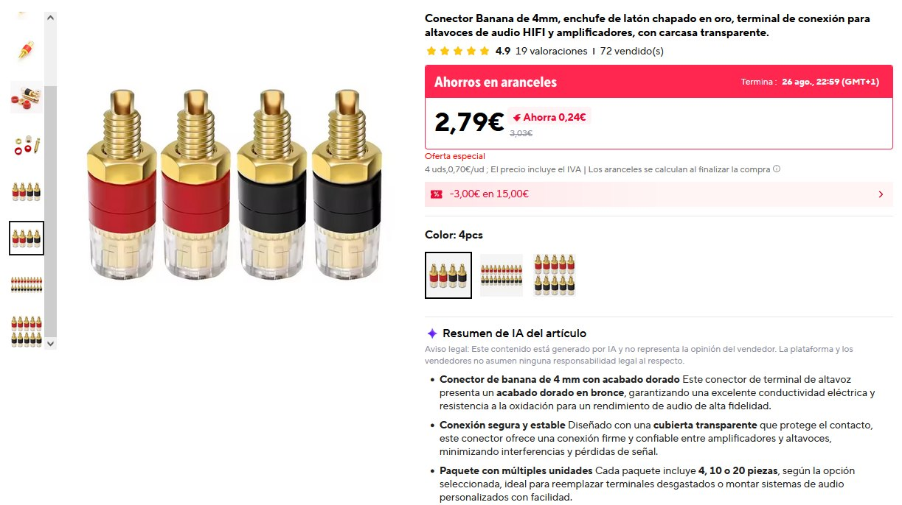

**Source:** [AliExpress](https://es.aliexpress.com/item/1005009310035531.html)

---

### 1.3 Rubber Feet

Use **11 × 9 × 6 mm rubber feet** with a **3 mm mounting hole**.

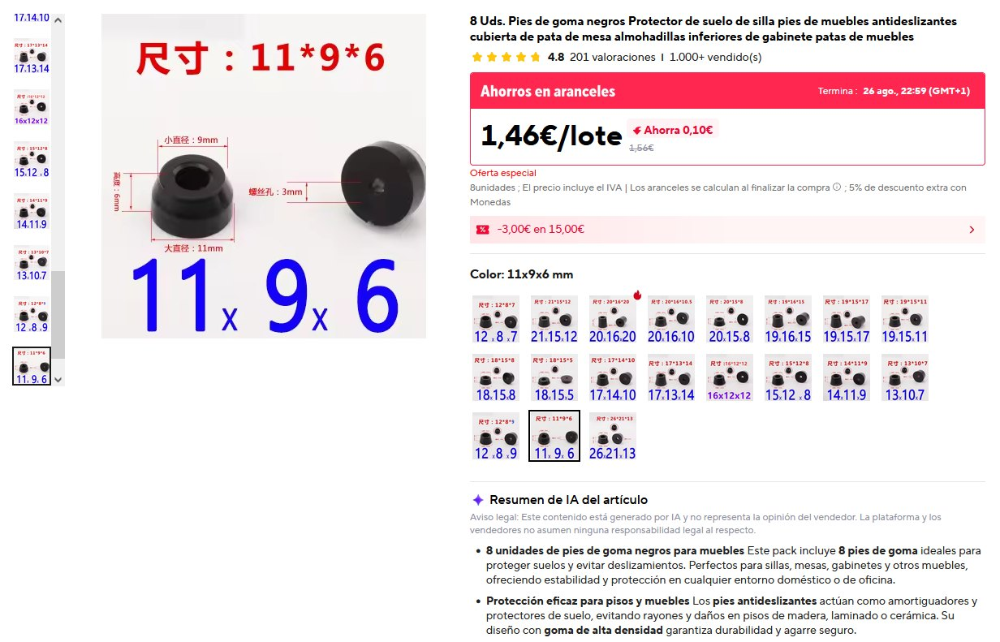

**Source:** [AliExpress](https://es.aliexpress.com/item/4001185787792.html)

---

### 1.4 Screws

Use:

#### M3 × 6 mm — speaker / feet

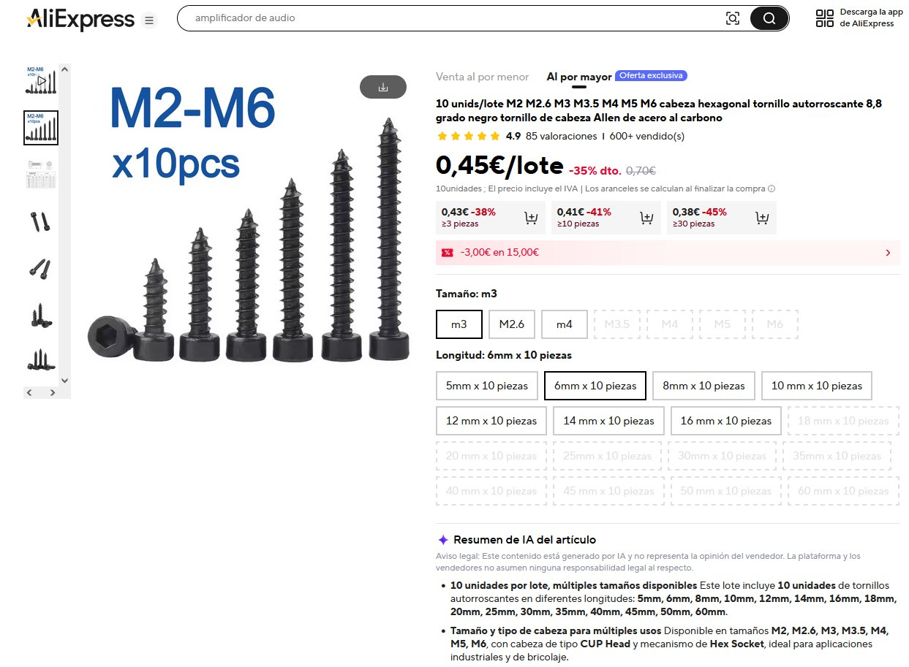

**Source:** [AliExpress](https://es.aliexpress.com/item/1005003179188298.html)

#### M2 × 8 mm — covers

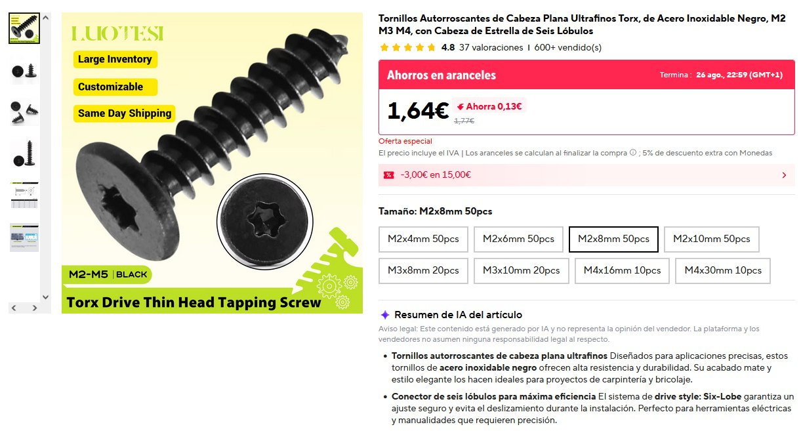

**Source:** [AliExpress](https://es.aliexpress.com/item/1005011545930370.html)

Torx or hex socket heads can be used.

For small inexpensive screws, **Torx is recommended because the head is less likely to strip during assembly**.

---

### 1.5 Speaker Cable

Speaker cable is required for internal wiring.

---

### 1.6 Gasket Material

Use **2 mm EVA foam sheet**.

This is standard craft EVA foam and can usually be found in stationery, craft or hobby stores.

No specific manufacturer is required.

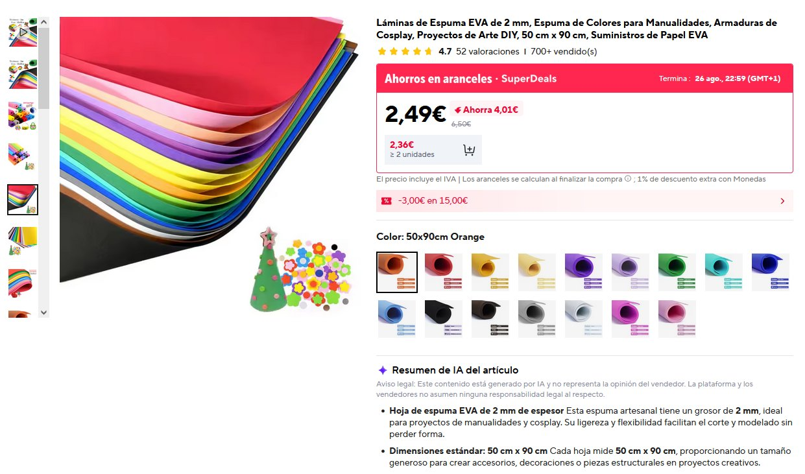

The supplied gasket template is used to cut the required pieces.

A laser cutter can be used if available.

If a laser cutter is not available, print the template at **100% / actual size** and cut the foam manually.

**Do not use "Fit to page".**

---

### 1.7 Cotton Pads

Use ordinary round makeup cotton pads approximately **55–60 mm in diameter**.

Use approximately **3 pads per module**.

The exact number may vary depending on the thickness of the pads from the manufacturer.

Trim the sides to approximately **38 mm width**, as shown below.

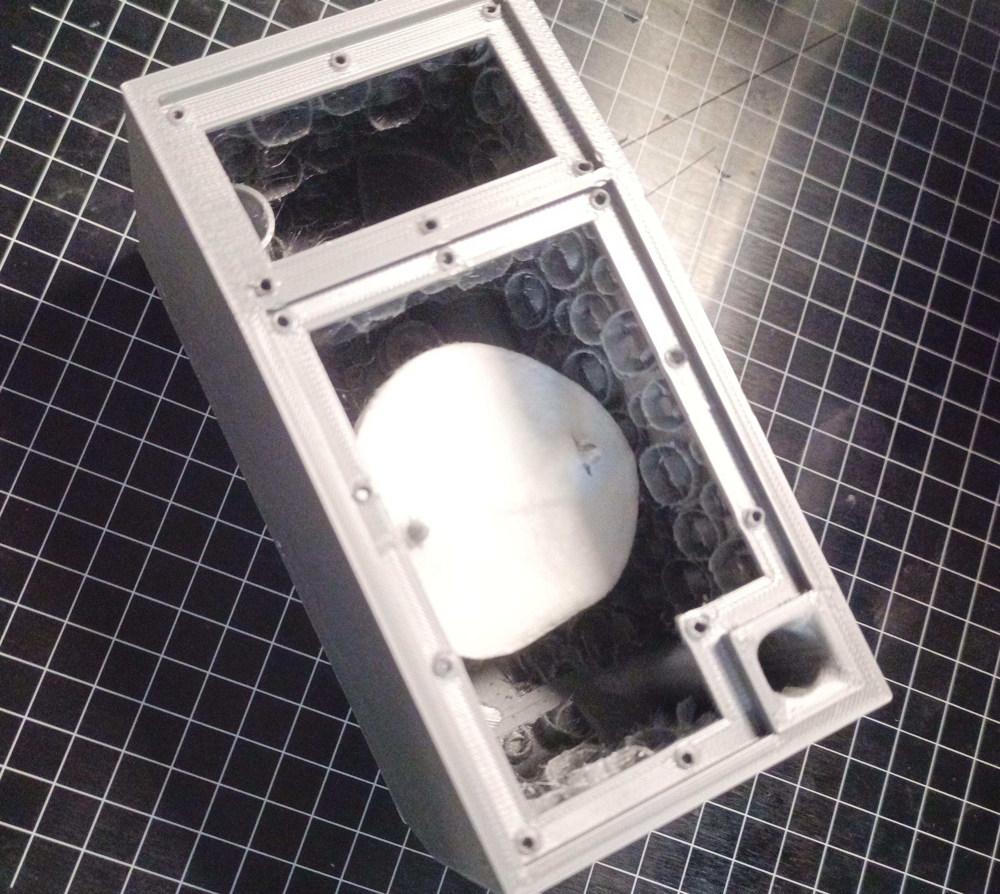

---

## 2. Print the Enclosure

Use the supplied STL files.

### Recommended print settings

- **Material:** PLA or PETG
- **Filament:** wood-filled filament recommended
- **Infill:** 10%
- **Perimeters:** 3
- **Supports:** none
- **Brim:** none

**Three perimeters are sufficient.**

The internal gap is part of the design.

**Keep the internal geometry as designed. Do not fill the gap.**

Printing temperature and other filament-specific settings should be selected
according to the filament manufacturer's recommendations.

### Mirrored modules

For a **Block 4** build, print:

- **2 normal modules**
- **2 mirrored modules**

There is no separate mirrored STL file. Use the **Mirror** function in your
slicer before printing the mirrored modules.

The required orientation is shown below.

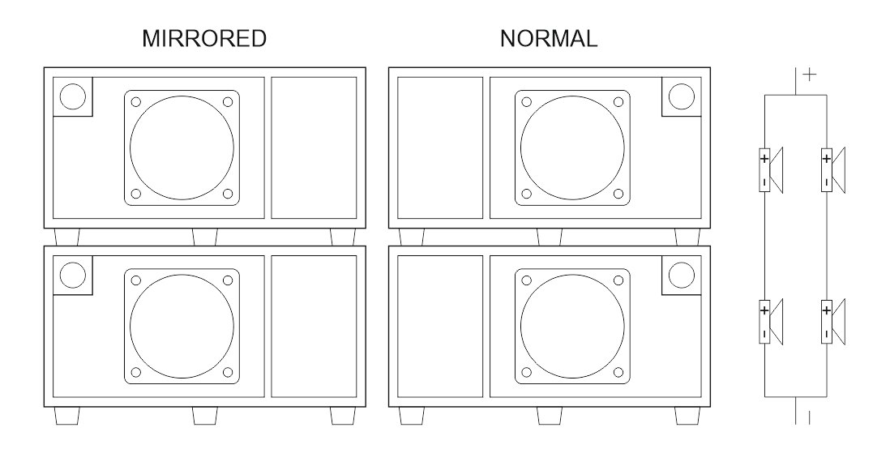

### PrusaSlicer reference

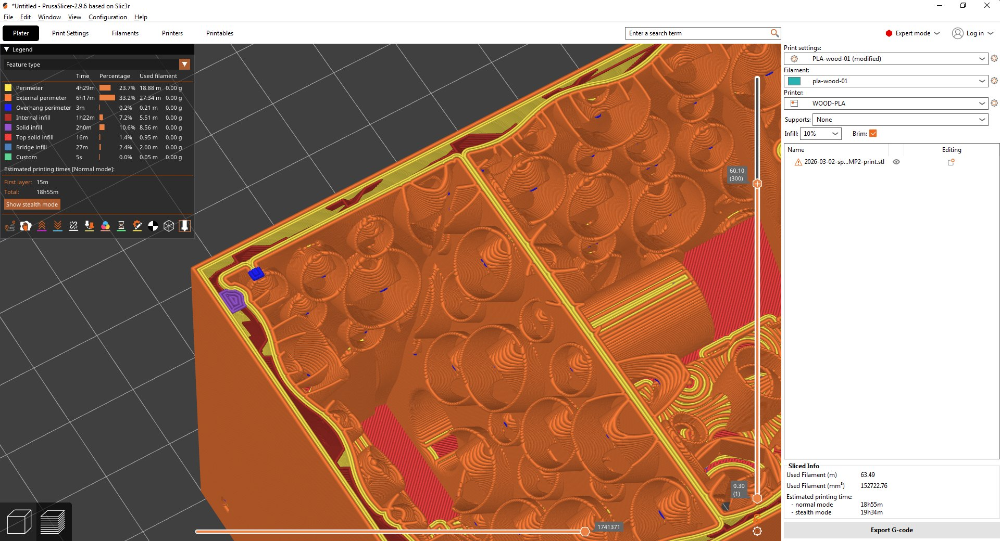

> **IMPORTANT — PRINT WITHOUT SUPPORTS.**  
> **Do not enable support material.** The internal DZ structure is designed for support-free printing. Supports inside the enclosure cannot be removed and may damage or block the internal pneumatic structure.

---

## 3. Prepare the Gaskets

Use the supplied gasket template and **2 mm EVA foam**.

### With a laser cutter

Use the supplied **SVG file** directly for laser cutting.

### Without a laser cutter

Print the gasket template at:

**100% / Actual Size**

Do not scale the template and do not use **Fit to page**.

Transfer the template to the 2 mm EVA foam and cut it manually using a suitable cutting tool.

---

## 4. Prepare the Cotton Pads

Use **55–60 mm round makeup cotton pads**.

Trim both sides as shown in the drawing, leaving approximately **38 mm width**.

Use approximately **3 pads per module**.

The exact number may vary slightly depending on the thickness of the pads.

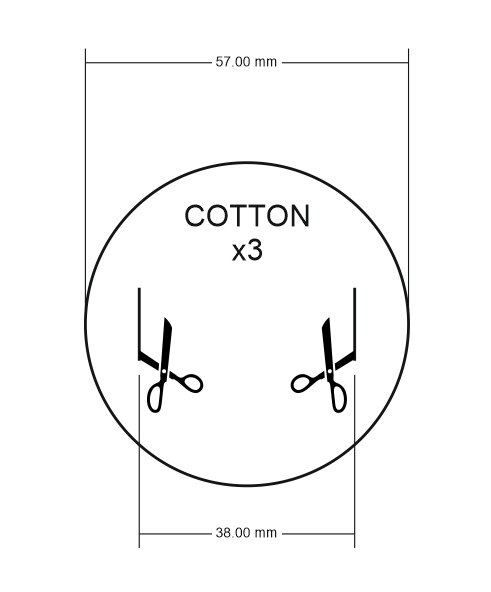

---

## 5. Assembly

1. Print the enclosure.
2. Solder the speaker cables to the 4 mm banana connectors.
3. Install the 4 mm banana connectors.
4. Prepare the cotton pads.
5. Install the cotton pads.
6. Cut and install the 2 mm EVA gaskets.
7. Install the front covers.
8. Connect and install the SOTAMIA 2" drivers.
9. Install the rubber feet.
10. Check all connections before connecting the system to an amplifier.

---
## 6. Wiring

For the basic configuration, connect **two 4 Ω drivers in series**.

Speaker cable is required for the internal connections.

### Block 4

Four modules can be assembled as a **Block 4** configuration.

Connect the four drivers in series as shown below.

---

## 7. Design Files

The complete reproduction package contains:

- 3D-printable STL files
- SVG gasket file for laser cutting

### Download

**[Download STL + SVG files](STL_SVG.zip)**

The mirrored modules are created using the **Mirror** function in your slicer, as described above.

---

## 8. Build. Test. Listen.
---

**DeltaSignum — Dynamic Zero**

*Open source. Build it, measure it, listen to it.*
