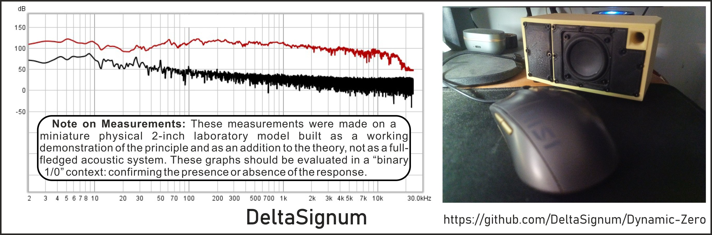
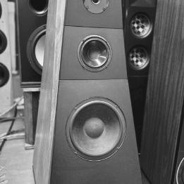
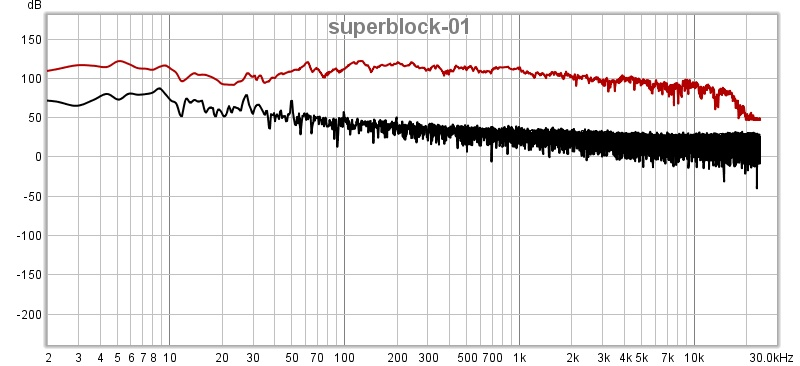

<br>

# Dynamic Zero (DZ)

**A Delta Signum Open Engineering Project**

Dynamic Zero (DZ) is an experimental open-source acoustic architecture exploring alternative approaches to loudspeaker system design.

Rather than treating the loudspeaker enclosure as a passive structure, Dynamic Zero investigates whether the acoustic energy normally dissipated behind the diaphragm can become an active part of the a[...]

Dynamic Zero is not a commercial loudspeaker.
It is an engineering research project.

---

## Origins



*First DZ prototype, circa 2000. 10-inch driver implementation.*

The core architectural ideas behind Dynamic Zero were first implemented around 2000 in a system built around a 10-inch driver.

The project remained dormant for many years. Financial constraints at the time of development, relocation, and the 2008 economic crisis interrupted its development rather than ending it.

The current work began after the original prototypes were found for sale in a Vilnius audio showroom — more than two decades after they were built. That discovery prompted a return to the original a[...]

This repository documents the current state of that continuation.

---

## Why?

Conventional loudspeaker systems primarily treat the rear diaphragm wave as an unavoidable by-product that must be absorbed, vented or delayed.

Dynamic Zero explores a different engineering question:

> **Can the rear acoustic wave become a useful system resource rather than an unavoidable loss?**

The project investigates methods for dynamically managing pneumatic energy inside the enclosure instead of simply dissipating it.

This approach may influence diaphragm loading, system behaviour and low-frequency performance while preserving a modular and scalable architecture.

Current implementations represent experimental prototypes intended for research rather than definitive engineering conclusions.

---

## Preliminary Measurements



*Superblock configuration (4 Modules, 2" full-range drivers). Red: signal. Black: no-signal noise floor.
MiniDSP UMIK-1, ~50 cm, workshop environment. Sweep 2 Hz–20 kHz.
Outdoor measurements (open air, Tenerife) show consistent results.*

---

## Architecture

Dynamic Zero is based on a recursive modular architecture built around four internal pneumatic elements: the **Dynamic Mass Interchanger (DMI)**, **DM Impulser**, **DM Container**, and **DM Delta Comp[...]

```
Module
   ↓
Block
   ↓
Superblock
   ↓
Megablock
```


Each level applies the same architectural principles at a different acoustic scale. System behaviour becomes progressively more stable and the effective low-frequency boundary lowers as individual Mod[...]

The architecture supports two implementation paths:

- **Recursive modular array** — Module → Block → Superblock → Megablock → N
- **Standalone implementation** — a single enclosure (e.g. a multi-way loudspeaker) applying DZ principles without recursive scaling

Dynamic Zero is not compatible with conventional Thiele–Small modelling. T/S assumes a linear, time-invariant system with fixed parameters. DZ is a state-dependent, nonlinear system with pneumatic s[...]

---

## Key Experimental Observations

- **Subharmonic generation:** Coherent subharmonic behaviour observed under specific drive conditions. The subharmonic evolution is rhythmic and repeatable rather than chaotic.
- **Array stabilisation:** Progressive low-frequency stabilisation and extension at each scaling step.
- **Compensator time constant:** Closing the DM Delta Compensator eliminates DZ effects immediately. Re-opening requires approximately 4–5 seconds to re-establish the pneumatic energy state.

---

## Research Areas

- Dynamic pneumatic energy management
- Modular acoustic architecture
- Phase coherence and dynamic diaphragm loading
- Low-frequency behaviour below conventional Fs limits
- Large-scale modular array systems
- Experimental measurements and physical modelling

---

## Open Engineering

Dynamic Zero is published as an open engineering project.

The objective is to encourage experimentation, independent verification and collaborative engineering rather than simply publishing finished products.

Successful experiments, unsuccessful experiments and design iterations are considered equally valuable.

This repository does not ask for belief. It provides an engineering architecture, documents its design decisions, and invites independent evaluation.

---

## Documentation

- [Glossary](docs/glossary.md) — Architectural terminology and term definitions
- [Technical Theory & Framework](docs/theory.md) — Core hypotheses, Fd < Fin, +0/−0 architecture, internal mechanics
- [Architecture Specification](docs/architecture.md) — Internal chamber specifications
- [Measurements](docs/measurements.md) — Empirical FR, SPL, and impedance data

---

## Repository Structure

```
README.md
docs/
    glossary.md
    theory.md
    architecture.md
    measurements.md
    prototypes.md
cad/
hardware/
measurements/
images/
```

---

## About Delta Signum

**Delta Signum** is an independent engineering initiative dedicated to experimental system architectures, measurement-driven development and open engineering.

Dynamic Zero is the first public project released under the Delta Signum initiative.

🔗 [deltasignum.org](https://deltasignum.org)

---

## Project Status

Dynamic Zero is an active research project. The architecture continues to evolve through iterative prototyping, measurements and engineering refinement.
