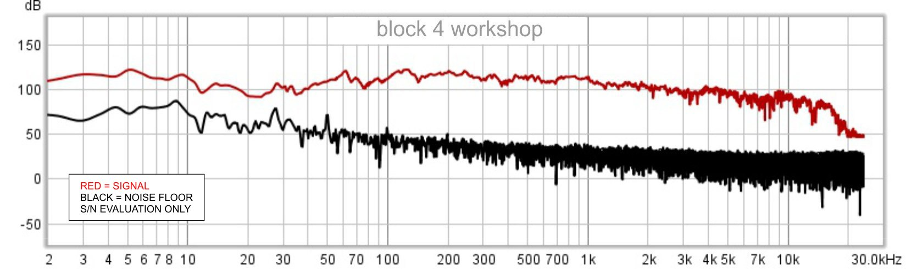
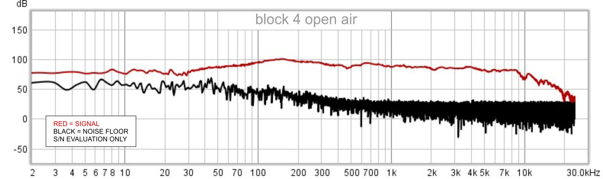
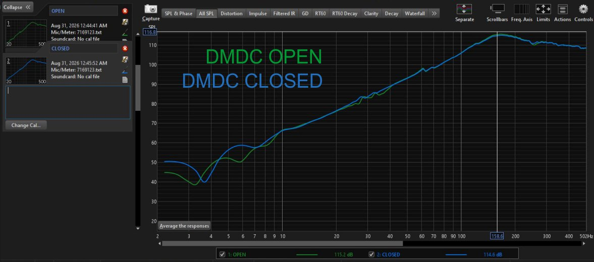

 

# Dynamic Zero (DZ)
### *(originally referred to as Dynamic Diffuser Mass)*

**A Delta Signum Open Engineering Project**

**A fully balanced mechanical-pneumatic architecture operating around dual dynamic reference points: +0 and −0.**

Dynamic Zero (DZ) is an experimental open engineering acoustic architecture exploring alternative approaches to loudspeaker system design. The architecture operates as a hybrid of acoustic-pneumatic mechanics and state-dependent momentum continuity.

Rather than treating the loudspeaker enclosure as a passive structure, Dynamic Zero investigates whether the acoustic energy normally dissipated behind the diaphragm can become an active part of the system.

Dynamic Zero is not a commercial loudspeaker.
It is an engineering research project.

---

## Origins

*First DZ prototype, circa 2000. 10-inch driver implementation.*

The core architectural ideas behind Dynamic Zero were first implemented around 2000 in a system built around a 10-inch driver.

The project remained dormant for many years. Financial constraints at the time of development, relocation, and the 2008 economic crisis interrupted its development rather than ending it.

The current work began after the original prototypes were found for sale in a Vilnius audio showroom — more than two decades after they were built. That discovery prompted a return to the original architectural framework.

This repository documents the current state of that continuation.

---

## Why?

Conventional loudspeaker systems primarily treat the rear diaphragm wave as an unavoidable by-product that must be absorbed, vented or delayed.

Dynamic Zero explores a different engineering question:

> **Can the rear acoustic wave become a useful system resource rather than an unavoidable loss?**

The project investigates methods for dynamically managing pneumatic energy inside the enclosure instead of simply dissipating it.

This approach may influence diaphragm loading, system behaviour and low-frequency performance while preserving a modular and scalable architecture.

Current implementations represent experimental prototypes intended for research rather than definitive engineering conclusions.

---

## Preliminary Measurements

> **Note on Measurements:** These measurements were made on a miniature physical 2-inch laboratory model built as a working demonstration of the principle and as an addition to the theory, not as a full-fledged acoustic system. These graphs should be evaluated in a “binary 1/0” context: confirming the presence or absence of the response.

---

*Block 4 configuration (4 Modules, 2" full-range drivers). Red: signal. Black: no-signal noise floor.
MiniDSP UMIK-1, ~50 cm, workshop environment. Sweep 2 Hz–20 kHz.
Outdoor measurements (open air, Tenerife) show consistent results.*

---

*Near-field measurement at approximately 2 cm from the diaphragm.*

This measurement is not a frequency-response characterization of the complete DZ system. The microphone was positioned approximately 2 cm from the diaphragm for a direct local A/B comparison between DMDC OPEN and DMDC CLOSED states.

**The measured behaviour is not characteristic of a conventional bass-reflex (DBR) system.**

---

## System scaling

---

## Recursive System Scaling

During experimentation, DZ modules were observed to couple and behave as a single, larger, self-balancing pneumatic system. The recursive Module → Block → Superblock → Megablock arrangement shown below is therefore provided as a practical connection and scaling recommendation, rather than as a separate DZ operating principle.

The names indicate successive levels of parallel scaling, while the number indicates the total number of Modules at each level. In such a scaled system, the Block becomes the minimum unit.

- **Recursive modular array** — Module → Block → Superblock → Megablock → N

---

## Key Experimental Observations

- **Subharmonic generation:** Coherent subharmonic behaviour observed under specific drive conditions. The subharmonic evolution is rhythmic and repeatable rather than chaotic.
- **Subsonic Harmonic Enhancement Effect (SHEE):** An experimentally observed effect in which subsonic excitation is accompanied by enhancement of higher harmonic components within the conventional acoustic reproduction range. This allows human hearing to perceive information originating below the conventional reproduction range, even from a small loudspeaker, producing a perceptual result similar to a DSP “bass enhancer” effect, but arising from the physical acoustic system rather than electronic signal processing. The effect weakens toward the driver's Fs.
- **Array stabilisation:** Progressive low-frequency stabilisation and extension at each scaling step.
- **Compensator time constant:** Closing the DM Delta Compensator suppresses some DZ effects DZ effects immediately. Re-opening requires approximately 4–5 seconds to re-establish the pneumatic energy state.

---

## Research Areas

- Dynamic pneumatic energy management
- Modular acoustic architecture
- Phase coherence and dynamic diaphragm loading
- Low-frequency behaviour below conventional Fs limits
- Large-scale modular array systems
- Experimental measurements and physical modelling

---

## Open Engineering

Dynamic Zero is published as an open engineering project.

The objective is to encourage experimentation, independent verification and collaborative engineering rather than simply publishing finished products.

Successful experiments, unsuccessful experiments and design iterations are considered equally valuable.

This repository does not ask for belief. It provides an engineering architecture, documents its design decisions, and invites independent evaluation.

---

## Documentation

- [Glossary](docs/glossary.md) — Architectural terminology and term definitions
- [Technical Theory & Framework](docs/theory.md) — Core hypotheses, Fd < Fin, +0/−0 architecture, internal mechanics
- [Architecture Specification](docs/architecture.md) — Internal chamber specifications
- [Measurements](docs/measurements.md) — Empirical FR, SPL, and impedance data
- [DIY Guide](DIY/BUILD.md) — Components, sourcing, 3D printing, slicer settings, assembly and wiring

---

## Conceptual Analogies

- [ICE ↔ DZ — Closed-Cycle Pneumatic Engine Analogy](docs/dz-ice-analogy.md)

---

## Repository Structure

README.md
docs/
    glossary.md
    theory.md
    architecture.md
    measurements.md
    prototypes.md
    dz-ice-analogy.md
cad/
hardware/
measurements/
images/
DIY/
    BUILD.md

---

## About Delta Signum

**Delta Signum** is an independent engineering initiative dedicated to experimental system architectures, measurement-driven development and open engineering.

Dynamic Zero is the first public project released under the Delta Signum initiative.

🔗 [deltasignum.org](https://deltasignum.org)  
📬 lab@deltasignum.org

---

## Project Status

Dynamic Zero is an active research project. The architecture continues to evolve through iterative prototyping, measurements and engineering refinement.

---

**Note:** Texts were organized and edited in English with AI assistance.  
All concepts, measurements, and conclusions are the author's original work.

---

## License

Dynamic Zero — © 2026 Mindaugas Mickus / Delta Signum Lab

Licensed under [CC BY-NC 4.0](LICENSE.txt).

Commercial licensing: [deltasignumlab@gmail.com](mailto:deltasignumlab@gmail.com)
