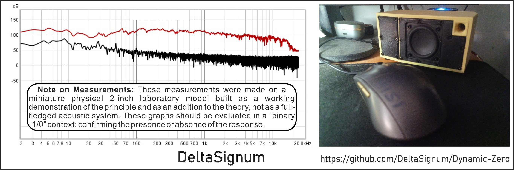
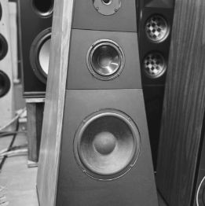
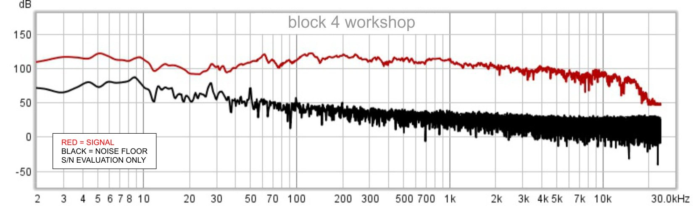
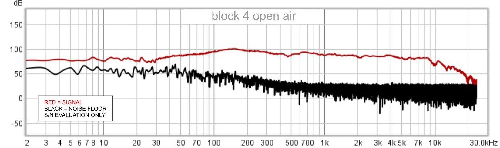
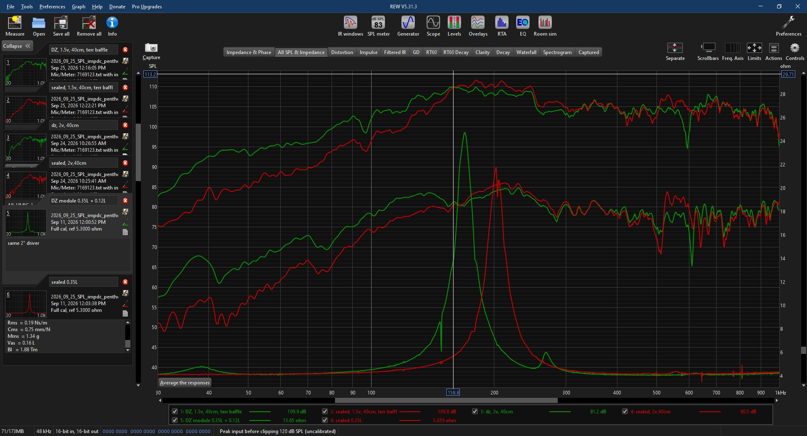
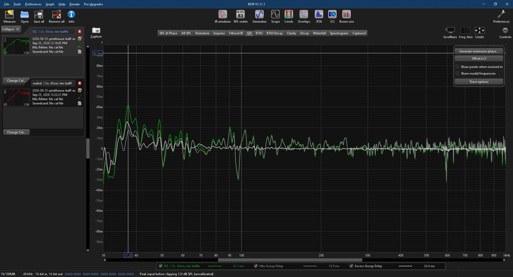
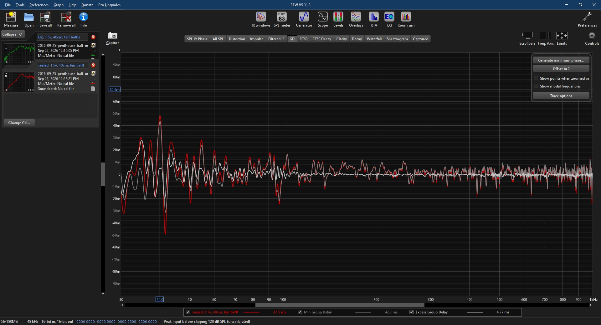

 

# Dynamic Zero (DZ)
### *(originally referred to as Dynamic Diffuser Mass)*

**A Delta Signum Open Engineering Project**

**A fully balanced mechanical-pneumatic architecture operating around dual dynamic reference points: +0 and −0.**

Dynamic Zero (DZ) is an experimental open engineering acoustic architecture exploring alternative approaches to loudspeaker system design. The architecture operates as a hybrid of acoustic-pneumatic mechanics and state-dependent momentum continuity.

Rather than treating the loudspeaker enclosure as a passive structure, Dynamic Zero investigates whether the acoustic energy normally dissipated behind the diaphragm can become an active part of the system.

Dynamic Zero is not a commercial loudspeaker.
It is an engineering research project.
---

> **Core Design Principle:**  
> The defining principle of Dynamic Zero is documented separately in [DESIGN_PRINCIPLE.md](DESIGN_PRINCIPLE.md).
> 
---

## Origins

*First DZ prototype, circa 2000. 10-inch driver implementation.*

The core architectural ideas behind Dynamic Zero were first implemented around 2000 in a system built around a 10-inch driver.

The project remained dormant for many years. Financial constraints at the time of development, relocation, and the 2008 economic crisis interrupted its development rather than ending it.

The current work began after the original prototypes were found for sale in a Vilnius audio showroom — more than two decades after they were built. That discovery prompted a return to the original architectural framework.

This repository documents the current state of that continuation.

---

## Why?

Conventional loudspeaker systems primarily treat the rear diaphragm wave as an unavoidable by-product that must be absorbed, vented or delayed.

Dynamic Zero explores a different engineering question:

> **Can the rear acoustic wave become a useful system resource rather than an unavoidable loss?**

The project investigates methods for dynamically managing pneumatic energy inside the enclosure instead of simply dissipating it.

This approach may influence diaphragm loading, system behaviour and low-frequency performance while preserving a modular and scalable architecture.

Current implementations represent experimental prototypes intended for research rather than definitive engineering conclusions.

---

## Preliminary Measurements

> **Note on this measurement:** TDue to the low SPL of the miniature 2-inch prototype and the measurement distance, this graph should primarily be evaluated in a “binary 1/0” context: confirming the presence or absence of the response rather than its absolute level.

---

*Block 4 configuration (4 Modules, 2" full-range drivers). Red: signal. Black: no-signal noise floor.
MiniDSP UMIK-1, ~50 cm, workshop environment. Sweep 2 Hz–20 kHz.
Outdoor measurements (open air, Tenerife) show consistent results.*

---

# DZ vs. sealed box - SPL and impedance

Same 2-inch driver, same 0.35 L primary volume, same sealed/DZ input.

**Green:** Dynamic Zero\
**Red:** sealed reference

The combined measurement shows two simultaneous changes:

-   the main impedance peak shifts from approximately 200 Hz to 170 Hz
    while increasing from approximately 22 Ω to 25 Ω;
-   the DZ configuration produces approximately 10 dB higher SPL across a broad low-frequency range compared with the sealed reference, while both responses remain similar at higher frequencies.

The important observation is the combination of a downward shift of the
main impedance peak, an increase in its magnitude, and a broadband SPL
increase.

These measurements show that the DZ pneumatic network changes the
electromechanical loading seen by the driver compared with the sealed
reference.

### Measurement Distance — 40 cm

The 40 cm measurement distance was chosen as a practical compromise.

At shorter distances, the result becomes highly sensitive to microphone position relative to the diaphragm and front outlet, and may not represent the combined acoustic output of the system.

At greater distances, environmental reflections and modes become more dominant, while the limited low-frequency output of the 2-inch driver reduces the signal-to-noise ratio.

**This is a comparative DZ vs. sealed-box test. Both configurations were measured under identical conditions, making their relative behaviour the primary observation.**

### Measurement Position Matters

Two microphone positions were used in separate DZ-to-sealed comparisons:

- **Driver near-field (approximately 1–2 cm from the diaphragm):** DZ produced approximately **4–5 dB higher SPL** than the sealed reference. The microphone position was matched between configurations.
- **40 cm measurement distance:** DZ produced up to approximately **10 dB higher SPL** in the measured low-frequency range, with the difference depending on frequency.

The near-field measurement characterizes the local driver response, while the 40 cm measurement captures the combined acoustic output of the DZ system.

These results describe separate comparisons at different microphone positions. **They are not additive** and do not establish independent SPL contributions from the diaphragm and the Dynamic Mass Delta Compensator (DMDC).

The physical explanation for the distance-dependent difference remains under investigation. No 1 m comparison has been measured.

---

# DZ vs. Sealed Box - Group Delay

*Dynamic Zero.*

*Sealed reference.*

Green: Dynamic Zero  
Red: sealed reference

Same 2-inch driver, same input, 40 cm measurement distance, and identical environmental conditions.

Despite the approximately **10 dB broadband increase in low-frequency SPL**, the DZ configuration exhibits practically the same overall group-delay behaviour as the sealed reference, without a corresponding broadband increase in delay.

The sharp fluctuations at very low frequencies are present in both measurements and should not be interpreted as individual system resonances without further verification.

**Key observation:** The increased low-frequency output is achieved without a corresponding increase in group delay relative to the sealed reference.

---

## Key Experimental Observations

- **Subharmonic generation:** Coherent subharmonic behaviour observed under specific drive conditions. The subharmonic evolution is rhythmic and repeatable rather than chaotic.
- **Subsonic Harmonic Enhancement Effect (SHEE):** An experimentally observed effect in which subsonic excitation is accompanied by enhancement of higher harmonic components within the conventional acoustic reproduction range. This allows human hearing to perceive information originating below the conventional reproduction range, even from a small loudspeaker, producing a perceptual result similar to a DSP “bass enhancer” effect, but arising from the physical acoustic system rather than electronic signal processing. The effect weakens toward the driver's Fs.
- **Compensator time constant:** Closing the DM Delta Compensator suppresses some DZ effect immediately. Re-opening requires approximately 4–5 seconds to re-establish the pneumatic energy state.

---

## Research Areas

- Dynamic pneumatic energy management
- Modular acoustic architecture
- Phase coherence and dynamic diaphragm loading
- Low-frequency behaviour below conventional Fs limits
- Large-scale modular array systems
- Experimental measurements and physical modelling

---

## Open Engineering

Dynamic Zero is published as an open engineering project.

The objective is to encourage experimentation, independent verification and collaborative engineering rather than simply publishing finished products.

Successful experiments, unsuccessful experiments and design iterations are considered equally valuable.

This repository does not ask for belief. It provides an engineering architecture, documents its design decisions, and invites independent evaluation.

---

## Documentation

- [Glossary](docs/glossary.md) — Architectural terminology and term definitions
- [Technical Theory & Framework](docs/theory.md) — Core hypotheses, Fd < Fin, +0/−0 architecture, internal mechanics
- [Architecture Specification](docs/architecture.md) — Internal chamber specifications
- [Measurements](docs/measurements.md) — Empirical FR, SPL, and impedance data
- [DIY Guide](DIY/BUILD.md) — Components, sourcing, 3D printing, slicer settings, assembly and wiring

---

## Conceptual Analogies

- [ICE ↔ DZ — Closed-Cycle Pneumatic Engine Analogy](docs/dz-ice-analogy.md)
- [Conceptual Continuity: Villchur → Dynamic Zero](docs/dz_villchur_analogy.md)
- [Bellows Analogy — Coupled Pneumatic Mass](docs/dz_bellows_analogy.md)

---

## Repository Structure

README.md
docs/
    glossary.md
    theory.md
    architecture.md
    measurements.md
    prototypes.md
    dz-ice-analogy.md
cad/
hardware/
measurements/
images/
DIY/
    BUILD.md

---

## About Delta Signum

**Delta Signum** is an independent engineering initiative dedicated to experimental system architectures, measurement-driven development and open engineering.

Dynamic Zero is the first public project released under the Delta Signum initiative.

🔗 [deltasignum.org](https://deltasignum.org)  
📬 lab@deltasignum.org

---

## Project Status

Dynamic Zero is an active research project. The architecture continues to evolve through iterative prototyping, measurements and engineering refinement.

---

**Note:** Texts were organized and edited in English with AI assistance.  
All concepts, measurements, and conclusions are the author's original work.

---

## License

Dynamic Zero — © 2026 Mindaugas Mickus / Delta Signum Lab

## License

Dynamic Zero is licensed under **CERN-OHL-W v2** (CERN Open Hardware Licence Weak Copyleft).

© 2026 Mindaugas Mickus / Delta Signum Lab

The goal of this license is to encourage replication, experimentation, manufacturing, and derivative designs while preserving attribution and project lineage.

See [LICENSE](LICENSE.txt) for details.

For commercial partnerships, custom designs, and author-supported implementations:  
[deltasignumlab@gmail.com](mailto:deltasignumlab@gmail.com)
