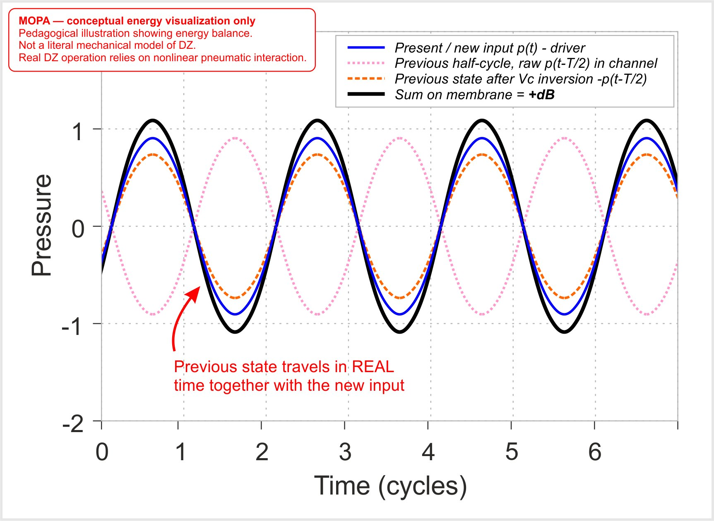
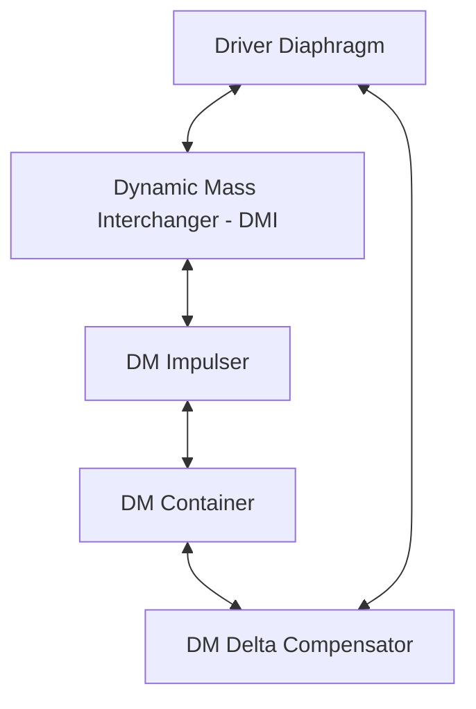

# Dynamic Zero (DZ)

> **Experimental Modular Acoustic Architecture & Dynamic Air Mass Control**

---

## Executive Overview

**Dynamic Zero (DZ)** is an experimental acoustic array architecture designed to govern system phase, acoustic loading, and force distribution in real time through a dynamic, state-dependent pneumatic air mass.

Rather than treating the cabinet as a static passive box, DZ couples the transducer diaphragm to a state-dependent pneumatic network consisting of four core functional nodes: the **Dynamic Mass Interchanger (DMI)**, **DM Impulser**, **DM Container**, and **DM Delta Compensator**.

The architecture is grounded in a single physical observation: in a conventional driver, the rear diaphragm surface generates an equal and opposite pressure wave that is discarded. DZ treats this anti-pressure as a real, recoverable energy state — the foundation of the entire system.


---

## Core Theoretical Framework & Physical Mechanics

| Traditional Acoustics | Dynamic Zero (DZ) | Consequence |
|---|---|---|
| Static resting point (0 V reference) | Dual dynamic reference points (+0 / −0) | Symmetrical energy distribution across both half-cycles |
| Fixed enclosure-dependent acoustic loading | State-dependent pneumatic loading | Effective pneumatic load changes with system state |
| Linear, time-invariant system | State-dependent, nonlinear system with memory | Adapts to instantaneous signal state in real time |
| Thiele–Small (T/S) compatible | Not fully represented by conventional T/S enclosure modelling | Requires new measurement and characterisation approach |

In essence, DZ treats the loudspeaker as a state-dependent pneumatic system rather than a purely reactive one, using the rear-wave energy as an active part of the acoustic process.

---

### 1. Balanced Excursion Architecture (+0 / −0 Reference Points)

Traditional driver topologies operate around a single static mechanical resting point — analogous to a single-ended amplifier operating between 0 V and +12 V. Under high excursion, this leads to asymmetric suspension strain and mechanical distortion.

**Dynamic Zero operates as a fully balanced (bridge-mode) mechanical-pneumatic architecture:**

- **Dual Dynamic Reference Points (+0 and −0):** The system operates around two dynamic phase-equilibrium points (+0 and −0), representing the instantaneous velocity turnover bounds of each half-cycle.
- **Full-Bridge Analogy:** Similar to a balanced audio amplifier splitting swing symmetrically (+6 V / −6 V), DZ treats both half-cycles as fully symmetric active operating regimes. This is not a physical increase in diaphragm excursion amplitude — it is an energetic symmetry principle: both half-cycles are actively driven by stored pneumatic energy, rather than one active half-cycle followed by a passive mechanical return.
- **Anticipatory Pneumatic Mechanism:** The pneumatic network operates through alternating positive and negative pressure states, reconstructing the *incoming* signal from the +0/−0 turnover point onward. The earlier this turnover point is identified, the more precisely the system anticipates the next wave front. This anticipatory behaviour — rather than reactive response — is the fundamental distinction from passive bass-reflex and transmission-line topologies.

---

### 2. Theoretical System States & Dynamic Targets

To model and evaluate the nonlinear behaviour of the DZ architecture, two governing physical concepts define the target dynamic state of the internal network.

#### Reciprocal Pneumatic Symmetry (RPS)

The architectural ideal state of a DZ module in which pneumatic energy across both half-cycles becomes functionally equivalent, independent of signal amplitude or frequency. In this state, the DM Impulser and DM Container operate as a unified two-phase mechanism, and the DM Delta Compensator functions only as a minor correction layer rather than an active participant.

RPS represents the theoretical design target of the DZ architecture. Practical implementations approach but do not guarantee this state, due to driver tolerances, chamber geometry variations, and diaphragm asymmetries.

#### Inter-Cycle Momentum Continuity (ICMC)

The retention of fluid (air mass) momentum state between successive half-cycles within the DZ pneumatic network. Each half-cycle output is constructed upon the momentum state established during the previous cycle, creating a continuous, time-dependent acoustic process.

ICMC is a physical property of the coupled chamber network — not an artificial storage mechanism, but a direct consequence of air mass inertia persisting across cycle boundaries.

---

### MOPA Analogy & Non-Resonant Operation

A useful conceptual analogy for the DZ energy interaction is a **Master Oscillator Power Amplifier (MOPA)**. DZ is not an acoustic implementation of an optical MOPA; the comparison refers only to the principle of retaining energy from a preceding state and using it to reinforce the incoming state.

The diagram below illustrates the idealised interaction between the inherited pneumatic state and the new driver-generated state:



In an idealised periodic T/2 case:

\[
p(t-T/2)=-p(t)
\]

After pneumatic inversion:

\[
p(t)+[-p(t-T/2)]=2p(t)
\]

This represents an ideal pressure ratio of 2:1, corresponding to approximately +6 dB. This theoretical value cannot be achieved in a real DZ system due to unavoidable losses.

---

#### Inter-Cycle Momentum Continuity (ICMC)
...

### MOPA Analogy
...

## Resonance Is Not the Operating Principle
...

### 3. The Dynamic Mass & Resonance Tracking Hypothesis (Fd < Fin)
...

---

### 3. The Dynamic Mass & Resonance Tracking Hypothesis (Fd < Fin)

Conventional Thiele–Small (T/S) theory relies on a fixed free-air driver resonance (Fs), below which diaphragm displacement becomes unconstrained and highly distorted.

DZ introduces the concept of **Dynamic Resonance (Fd)**:

- **Fluid Momentum Coupling:** The internal chambers act as an adaptive pneumatic governor. As signal velocity changes, flow inertia through the DM Impulser dynamically alters the effective air mass coupled to the diaphragm.
- **Frequency Tracking (Fd < Fin):** As the incoming signal frequency (Fin) drops, the active moving air mass automatically increases, keeping the system's dynamic resonance Fd **continuously below the instantaneous input frequency**.
- **Controlled Displacement:** Because Fin constantly remains above Fd, the diaphragm operates in a continuously loaded acoustic regime across all frequencies — eliminating uncontrolled sub-resonance excursion.

> **Note:** Conventional T/S enclosure modelling does not fully characterise DZ behaviour. T/S assumes a linear, time-invariant system with fixed parameters. DZ is a state-dependent, nonlinear system with memory across half-cycles. Standard T/S tools alone cannot characterise its behaviour.

---

### Why T/S Modelling Does Not Fully Apply to DZ

The fundamental difference is one of design priority: conventional T/S enclosure modelling is resonance-centred, while DZ is pneumatic-process-centred.

T/S driver parameters (Fs, Vas, Qts, Re, etc.) remain valid for characterising the driver itself. However, conventional T/S enclosure simulation assumes a passive acoustic load. Because DZ actively manages the pneumatic state surrounding the driver, T/S simulation output does not predict DZ system behaviour — even when accurate driver parameters are used.

T/S modelling characterises the driver/enclosure system primarily through small-signal parameters, acoustic compliance, moving mass, damping and resonant behaviour. DZ does not deny these effects, nor does it claim that resonance or wave phenomena disappear.

Instead, the DZ architecture is designed primarily around the pneumatic state and controlled mass exchange surrounding the radiator. Resonant and wave effects remain present, but they are not the primary mechanism around which the internal architecture is dimensioned.

Therefore, reducing DZ to chamber volumes and equivalent port lengths can produce a conventional resonant model of the geometry, but it does not necessarily describe the pneumatic behaviour that the DZ architecture is intended to control.

DZ also introduces system variables that are not represented directly in the conventional T/S parameter set: the effective front-to-rear interaction area ratio (including rear-side restrictions from the voice-coil former, basket openings and motor structure), nonlinear suspension behaviour across dual dynamic reference points (+0/−0), and state-dependent pneumatic coupling with momentum continuity across half-cycles.

---

### 4. Theoretical Low-Frequency Extension Towards 0 Hz

The Dynamic Zero principle itself does not impose a theoretical lower-frequency boundary. Under idealised conditions, the operating frequency may asymptotically approach 0 Hz.

Practical implementations are limited by two distinct constraint layers:

- **Driver constraints:** volumetric air displacement (ΔV), mechanical suspension compliance, and motor linearity.
- **DZ architecture constraints:** chamber geometry, internal damping, and construction tolerances — all of which affect how precisely the pneumatic network can track and anticipate low-frequency half-cycles.

This theoretical limit highlights the core promise of DZ: low-frequency reproduction is no longer fundamentally limited by the driver's mechanical resonance in a fixed box, but by the engineering precision of the pneumatic network and the volumetric displacement capability of the transducer.

---

## Internal Cycle Mechanics Around Turnover Points

Within an individual module, energy interchange operates as a continuous, momentum-driven fluid pendulum:




1. **Mass Accumulation (DMI):** The Dynamic Mass Interchanger gathers a dense, active air mass directly behind the moving diaphragm.
2. **Impulse Injection (DM Impulser):** Accumulated air is accelerated through the Impulser — the inertial initiator element without which the signal cannot be coherently reconstructed across cycles.
3. **Dual-State Mass in Time (DM Container):** The Container holds the air mass in alternating energy states — positive (compression) and negative (rarefaction) — effectively separated in time. This stored past-cycle energy forms the base upon which the incoming signal constructs the present acoustic output.
4. **Time & Asymmetry Compensation (DM Delta Compensator):** The Compensator absorbs fluid phase delays, timing mismatches between past stored energy and the incoming wave, and structural pressure asymmetries. It activates only when past and future half-cycles diverge; under ideal conditions, it remains acoustically silent.
5. **Reciprocal Inverted Push:** Near the +0/−0 turnover points, the stored energy state naturally reverses, dynamically pre-loading the diaphragm for the incoming wave front.

> *This represents the working theoretical hypothesis under ideal DZ conditions. Practical chamber volume ratios and geometric tolerances are continuously refined through empirical prototyping. Precision of internal geometry is critical: mistimed resonances within chambers or channels will destabilise the architecture.*

---

## Scalable Array Topology

Dynamic Zero modules can be combined into larger arrays.

During early experiments, an interaction between individual DZ modules was observed when multiple modules were connected **in series**. The combined system did not behave simply as a collection of independent modules, suggesting that electrical connection topology and the resulting driver interaction may influence the overall system behaviour.

This effect is currently experimental and has not yet been systematically characterised.

---

**Array topology note:** Early experiments indicate that DZ modules may interact when connected in series. The resulting behaviour suggests that electrical connection topology can influence interaction between individual modules. The effect has not yet been systematically characterised.

---

## Key Experimental Observations

- **Subharmonic Generation:** Strong, coherent subharmonic tracking observed under specific drive conditions. Subharmonics track proportionally as input frequency changes — structured, not chaotic — consistent with a nonlinear system with memory.
- **Array Stabilisation:** System behaviour becomes progressively more stable and the effective low-frequency boundary lowers as individual Modules scale into Blocks and Superblocks.
- **Compensator Time Constant:** Closing the DM Delta Compensator eliminates DZ effects immediately. Re-opening requires approximately 4–5 seconds for the system to re-establish its pneumatic energy state — consistent with a physical energy accumulation time constant, not an electronic switching artefact.

---

## Primary Research Objectives

1. Formalize the mathematical state-space model for state-dependent dynamic air mass coupling.
2. Empirical measurement of phase response and impedance shifts across scaling steps (Module → Megablock 64).
3. Open-source release of 3D-printable CAD models, slice profiles, and measurement sets for independent verification.

---

## Implementation Paths

Dynamic Zero is an architectural principle, not a fixed product form. It supports two distinct implementation paths:

- **Recursive modular architecture:** Module → Block → Superblock → Megablock → N. The system grows as a self-similar array; each scaling step adds emergent properties not present at the level below.
- **Standalone architecture:** A single enclosure — for example, a premium multi-way loudspeaker — implementing DZ principles (DMI, DM Impulser, DM Container, DM Delta Compensator) without further recursive scaling.

Both paths share the same core operating principle. The choice between them is an engineering decision, not an architectural one.

---

## Relation to Acoustic Suspension

DZ was developed independently of Villchur's work, but can be understood as its extension. Villchur used enclosed air as a spring. DZ uses enclosed air as a working fluid in a regenerative pneumatic system.

**Acoustic suspension: air as spring.**

**Dynamic Zero: air as working fluid.**

The historical path is independent, but the physical idea is continuous: **from spring to engine.**

---

## Repository Structure

```
├── README.md
├── docs/
│   ├── theory.md          # Fd tracking & mathematical state-space formulation
│   ├── architecture.md    # Internal chamber mechanics (DMI, Impulser, Container, Compensator)
│   └── measurements.md    # Empirical FR, SPL, and impedance measurement sets
├── cad/                   # 3D-printable STL/STEP files for DZ Modules
├── hardware/              # Assembly topology & coupling hardware specifications
└── images/                # Array topology diagrams, SPL plots, schema
```
---
*Delta Signum — deltasignum.org*
